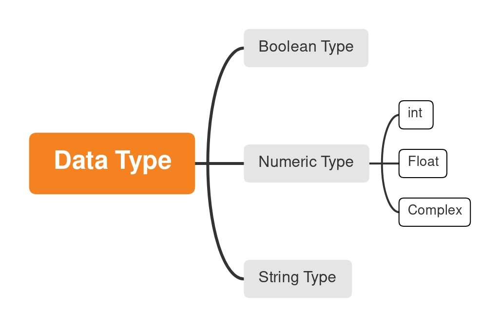

## 자료형



- 수치형(Numeric Type)
    - int (정수형, integer)
        - 0, 100, -200과 같은 정수를 표현하는 자료형
            - 일반적인 수학 연산(사칙 연산 가능)
        - 진수 표현
            - 2진수(binary) : 0b
            - 8진수(octal) : 0o
            - 16진수(hexadecimal) : 0x
    - float (부동소수점, 실수, floating point number)
        - 유리수와 무리수를 포함하는 ‘실수’를 다루는 자료형
        - 실수 연산시 주의할 점(**부동 소수점**)
            - 실수의 값을 처리할 때 의도하지 않은 값이 나올 수 있음
            
            ```python
            print(3.2 - 3.1) # 0.1000000000000000
            print(1.2 - 1.1) # 0.9999999999999987
            ```
            
            - 원인은 부동 소수점 때문
                - 
                
                컴퓨터는 2진법, 사람은 10진법을 사용
                10진수 0.1은 2진수로 표현하면 0.0001100… 같이 무한대로 반복
                무한대 숫자를 그대로 저장할 수 없어 사람이 사용하는 10진법의 근사값만 표시.. 이런 과정에서 예상치 못한 결과가 나타남
                
        - 부동 소수점  - 해결책
            - 매우 작은 수보다 작은지를 확인하거나 math 모듈 활
            
            ```python
            a = 3.2 - 3.1 # 0.1000000000000000
            b = 1.2 - 1.1 # 0.9999999999999987
            
            # 1. 임의의 작은 수 활용 (입실론)
            print(abs(a - b) <= 1e-10) #true
            
            # 2. python 3.5이상
            import math
            print(math.isclose(a, b)) #true
            ```
            
    - complex (복소수, complex number)
- 문자열 (String Type)
    - 모든 문자는 str 타입
        - 문자열은 작은따옴표나 큰따옴표를 활용하여 표기
        - PEP8에서는 소스코드 내에서 하나의 문장부호를 선택하여 유지하도록 함
    - Escape Sequence
        - 역슬래시 뒤에 특정 문자가 와서 특수한 기능을 하는 문자 조합
        
        | 예약 문자 | 내용(의미) |
        | --- | --- |
        | \n | 줄 바꿈 |
        | \t | 탭 |
        | \r | 캐리지 리턴 |
        | \o | 널(null) |
        | \\ | \ |
        | \’ | 단일인용부호(’) |
        | \” | 이중인용부호(”) |
    - 문자열 연산
        - 덧셈
        
        ```python
        print('hello'+'world') # helloworld
        ```
        
        - 곱셈
        
        ```python
        print('python'*3) #pythonpythonpython
        ```
        
    - String Interpolation (문자열을 변수로 활용하여 만드는 법)
        - % - formatting  #예전에 쓰던 방식
        
        ```python
        name = 'kim'
        score = 4.5
        
        print('hello, %s' % name) # hello, kim
        print('내 성적은 %d' % score) # 내 성적은 4
        print('내 성적은 %f' % scrore) # 내 성적은 4.5
        ```
        
        - str.format() #예전에 쓰던 방식
        
        ```python
        name = 'kim'
        score = 4.5
        
        print('hello, {}! 성적은 {}'.format(name, score))
        # hello, kim! 성적은 4.5
        ```
        
        - f-strings #python 3.6 이후로 주로 쓰는 방식
        
        ```python
        name = 'kim'
        score = 4.5
        
        print(f'hello, {name}! 성적은 {score}') # hello, kim! 성적은 4.5
        
        import datetime
        today = datetime.datetime.now()
        print(today) # 2022-07-18 11:45>45 .200411
        
        print(f'오늘은 {today:%y}년 {today:%m}월 {today:%d}일')
        # 오늘은 22년 07월 18일
        ```
        
- 불린형 (Boolean Type)
    - 논리 자료형으로 참과 거짓을 표현하는 자료형
    - True 또는 False를 값으로 가짐
    - 비교 / 논리 연산에서 활용됨
        - 비교 연산자
            - 수학에서 등호와 부등호와 동일한 개념
            - 주로 조건문에 사용되며 값을 비교할 때 사용
            - 결과는 True / False 값을 리턴함
            
            | < | 미만 |
            | --- | --- |
            | <= | 이하 |
            | > | 초과 |
            | >= | 이상 |
            | == | 같음 |
            | != | 같지 않음 |
        - 논리 연산자
            - 모든 조건을 만족하거나(and), 여러 조건 중 하나만 만족해도 될 때(or)
            - 일반적으로 비교연산자와 함께 사용됨
            
            | 연산자 | 내용 |
            | --- | --- |
            | A and B | A와 B  모두 True일시, True |
            | A or B | A와 B 중 하나라도 True일시, True |
            | Not | True를 False로, False를 True로 |
        - 논리 연산자 주의할 점 / not 연산자
            - Falsy : False는 아니지만 False로 취급 되는 다양한 값
                - 0, 0.0, (), [], {}, None, “”(빈 문자열)
            - 논리 연산자도 우선 순위가 존재
                - not, and, or 순으로 우선순위가 높음
            - 논리 연산자의 단축 평가
                - 결과가 확실한 경우 두번째 값은 확인하지 않고 첫번째 값 반환
                - and 연산에서 첫번째 값이 False인 경우 무조건 False → 첫번째 값 반환
                - or 연산에서 첫번째 값이 True인 경우 무조건 True → 첫번째 값 반환
- None
    - 값이 없음을 표현하기 위해 None 타입이 존재
    - 일반적으로 반환 값이 없는 함수에서 사용하기도 함