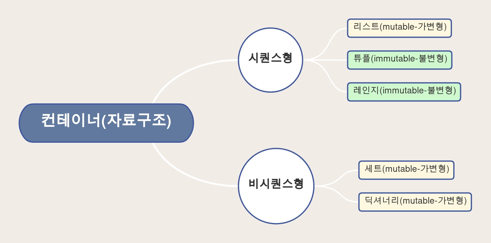

# 컨테이너(자료구조)

## 컨테이너란?

- 여러 개의 값(데이터)을 담을 수 있는 것(객체)으로, 서로 다른 자료형을 저장할 수 있음
    - 예시 : List
- 컨테이너의 분류
    - 순서가 있는 데이터( Ordered) vs. 순서가 없는 데이터 (Unordered)
    - 순서가 있다 != 정렬되어 있다.



## 리스트

- 리스트는 여러 개의 값을 순서가 있는 구조로 저장하고 싶을 때 사용

### 리스트의 생성과 접근

- 리스트는 대괄호([]) 혹은 list()를 통해 생성
    - 파이썬에서는 어떠한 자료형도 저장할 수 있으며, 리스트 안에 리스트도 넣을 수 있음
    - 생성된 이후 내용 변경이 가능 → 가변 자료형
    - 이러한 유연성 때문에 파이썬에서 가장 흔히 사용
- 순서가 있는 시퀀스로 인덱스를 통해 접근 가능
    - 값에 대한 접근은 list[i]
    
    ```python
    # 리스트명 = [요소1, 요소2, 요소3, ...]
    list_a = []
    list_b = [1, 2, 3]
    list_c = ['life', 'is', 'too', 'short']
    list_d = [1, 2, 3, 'python', ['리스트', '안에', '리스트']]
    ```
    
    ```python
    location = ['서울', '대전', '구미', '광주', '부울경']
    print(location) ['서울', '대전', '구미', '광주', '부울경']
    print(type(location)) # <class 'list'>
    print(location[0]) # 서울
    ```
    
    - 리스트는 담고 있는 요소를 바꿀 수 있다. → 가변 자료형
    
    ```python
    location[0] = '양양'
    print(location) ['양양', '대전', '구미', '광주', '부울경']
    ```
    

---

## 튜플

- 튜플은 여러 개의 값을 순서가 있는 구조로 저장하고 싶을 때 사용
    - 리스트와의 차이점은 생성 후, 담고 있는 값 변경이 불가 (불변 자료형)
- 항상 소괄호 형태로 사용

### 튜플의 생성과 접근

- 소괄호() 혹은 tuple()을 통해 생성
- 튜플은 수정 불가능한 시퀀스로 인덱스로 접근 가능
- 값에 대한 접근은 [i]

### 튜플 생성 주의사항

- 단일 항목의 경우
    - 하나의 항목으로 구성된 튜플은 생성 시 값 뒤에 쉼표를 붙여야 함
- 복수 항목의 경우
    - 마지막 항목에 붙은 쉼표는 없어도 되지만, 넣는 것을 권장

### 튜플 대입

- 튜플 대입이란?
    - 우변의 값을 좌변의 변수에 한 번에 할당하는 과정
- 튜플은 일반적으로 파이썬 내부에서 활용
    - 추후 함수에서 복수의 값을 반환할 때에도 활용

---

### Range

- 숫자의 시퀀스를 나타내기 위해 사용
- 주로 반복문과 함께 사용됨

---

### 슬라이싱 연산자

- 인덱스와 콜론을 사용하여 문자열의 특정 부분만 잘라낼 수 있음
- 슬라이싱을 이용하여 문자열을 나타낼 때 콜론을 기준으로 앞 인덱스에 해당하는 문자는 포함되지만 뒤 인덱스에 해당 문자는 미포함

```python
# 리스트 ([1:4] 1~4중 1은 포함 4는 미포함)
print([1, 2, 3, 5][1:4]) # [2, 3, 5]

# 튜플(0~2 중 2는 미포함)
print((1, 2, 3,)[:2]) # (1, 2)

# 시퀀스를 k간격으로 슬라이싱
print([1, 2, 3, 5][0:4:2]) # [1, 3]
```

```python
s = 'abcde'
s[::] # 'abcde' , 처음부터 끝까지
s[::-1] # 'edcba' , 끝부터 처음까지
```

---

### 셋(Set)

- Set이란 중복되는 요소가 없어, 순서에 상관없는 데이터들의 묶음
    - 데이터의 중복을 허용하지 않기 때문에 중복되는 원소가 있다면 하나만 저장
    - 순서가 없기 때문에 인덱스를 이용한 접근 불가능
- 수학에서의 집합을 표현한 컨테이너
    - 집합 연산이 가능(여집합을 표현하는 연산자는 별도로 존재 x)
    - 중복된 값이 존재하지 않음
- 담고 있는 요소를 삽입 변경, 삭제 가능 → 가변 자료형

### 셋 생성

- 중괄호{} 혹은 set()을 통해 생성
    - 빈 Set을 만들기 위해서는 set()을 반드시 활용해야 함
        - 빈 {}를 활용할 경우 Dictionary가 생성되기 때문
- 순서가 없어 별도의 값에 인덱스로 접근할 수 없음

### 셋 사용하기

- 셋을 활용하면 여러 개 값을 저장한 다른 컨테이너의 중복된 값을 쉽게 제거할 수 있음
    - 단, 이후 순서가 무시되므로 순서가 중요한 경우 사용할 수 없음

### 셋 연산자

- | : 합집합
- & : 교집합
- - : 차집합
- ^ : 대칭차집합
- 여집합은 없음

---

## 딕셔너리

- 키-값(key-value) 쌍으로 이뤄진 자료형(3.7부터는 ordered, 이하 버전은 unordered)
- 키는 변경 불가능한 데이터(immutable)만 활용 가능
    - string, integer, float, boolean, tuple, range
- 값은 어떠한 형태든 관계없음

### 딕셔너리 생성

- 중괄호{} 혹은 dict()을 통해 생성
- key를 통해 value에 접근

---

## 형 변환

- 파이썬에서 데이터 형태는 서로 변환할 수 있음
- 암시적 형 변환 - 파이썬이 자동으로 변환
    - 사용자가 의도하지 않고, 파이선 내부적으로 자료형을 변환하는 경우
- 명시적 형 변환 - 개발자가 의도적으로 변환
    - 사용자가 특정 함수를 활용하여 의도적으로 자료형을 변환하는 경우

### 암시적 형 변환

- 사용자가 의도하지 않고 파이썬 내부적으로 자료형을 변환 하는 경우
    - boolean
    - Numeric type (int, float)
    
    ```python
    print(True + 3) # 4
    print(3 + 5.0) # 8.0
    ```
    

### 명시적 형 변환

- int
    - str, float → int
    - 단, 형식에 맞는 문자열만 정수로 변환 가능
    
    ```python
    print('3' + 4) # TypeError : 문자열과 정수형을 더하려 해서
    print(int('3') + 4) # 7
    print(int('3.5') + 5) # ValueError : 실수형을 int로 바꾸려해서 에러
    ```
    
- float
    - str, int → float
    - 단, 형식에 맞는 문자열만 정수로 변환 가능
- str
    - int, float, list, tuple, dict → str